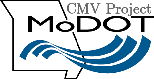

# MoDOT Unified Commercial Motor Vehicle (CMV) Data Exchange Schema and API

The **MoDOT Unified Commercial Motor Vehicle (CMV) Data Exchange Schema and API** aims to enhance the safety and efficiency of CMVs by providing a unified access point to a wide range of real-time data streams. This project focuses on consolidating essential information, such as traffic conditions, work zone activity, parking availability, and weather reports, into a standardized, cohesive platform for use by commercial motor vehicles and their operators.

Much like the **Work Zone Data Exchange (WZDx) Specification**, this project simplifies access to vital data for CMVs, enabling third-party systems, such as fleet management software and navigation tools, to ingest and utilize up-to-date information. This harmonized approach minimizes delays, reduces data inconsistencies, and improves situational awareness, allowing CMVs to make better-informed decisions on the road.

### Key Features of the Unified API:
- **Real-Time Data Integration**: Combines diverse data sources, including work zone information, incidents, weather, parking, and traffic conditions.
- **Standardized Data Schema**: The API follows a consistent structure, making data more accessible for third-party developers and CMV operators.
- **Enhanced Interoperability**: Ensures seamless communication across various data sources, reducing operational risks and improving efficiency.
- **Secure, Efficient Communication**: Implements robust security protocols to protect sensitive information and maintain data integrity.
- **Customizable API Responses**: Allows users to query and filter data based on their specific needs, such as route optimization or real-time incident reporting.

# Table of Contents

[Table of Contents](#table-of-contents)

[List of Figures](#list-of-figures)

[List of Tables](#list-of-tables)

[1 CMV Data Feed Standards and API Development](#cmv-data-feed-standards-and-api-development)

[1.1 Review of Current Data Schema in CMV Communication 4](#review-of-current-data-schema-in-cmv-communication)

[1.1.1 Workzone API Schema](#workzone-api-schema)

[1.1.2 Weather API Schema](#weather-api-schema)

[1.1.3 TMS Incidents API](#tms-incidents-api)

[1.1.4 Waze Jams API Schema](#waze-jams-api-schema)

[1.1.5 Waze Incidents API Schema](#waze-incidents-api-schema)

[1.1.6 Parking Information API Schema](#parking-information-api-schema)

[2 Objectives of the Unified Schema](#objectives-of-the-unified-schema)

[2.1 Integration of Multiple Data Sources](#integration-of-multiple-data-sources)

[2.2 Real-Time Communication](#real-time-communication)

[2.3 Standardized Data Format](#standardized-data-format)

[3 Design and Architecture of the Unified Schema](#design-and-architecture-of-the-unified-schema)

[3.1 Overview of Schema Structure](#overview-of-schema-structure)

[3.1.1 Data Sources and Incident Types](#data-sources-and-incident-types)

[3.1.2 Flexible Querying and Filtering Mechanism](#flexible-querying-and-filtering-mechanism)

[3.1.3 Route-Based Querying](#route-based-querying)

[3.2 Key Components of the Unified Schema](#key-components-of-the-unified-schema)

[3.2.1 Schema Information](#schema-information)

[3.2.2 Sources](#sources)

[3.2.3 Incidents](#incidents)

[3.2.4 Metadata](#metadata)

[3.3 Methodology for Data Harmonization](#methodology-for-data-harmonization)

[4 Design and Architecture of the Unified API System](#design-and-architecture-of-the-unified-api-system)

[4.1 Design Principles](#design-principles)

[4.2 Architecture Overview](#architecture-overview)

[4.3 Key Components](#key-components)

[4.3.1 API Gateway](#api-gateway)

[4.3.2 Data Integration Layer](#data-integration-layer)

[4.3.3 Database/Cache Layer](#database-cache-layer)

[4.3.4 Service Query Engine](#service-query-engine)

[4.3.5 Security and Authentication Layer](#security-and-authentication-layer)

[4.3.6 Monitoring and Logging](#monitoring-and-logging)

[4.4 Technologies Used](#technologies-used)

[4.5 Key Functionalities of the Unified API](#key-functionalities-of-the-unified-api)

[4.6 Other Functionalities of the Unified API](#other-functionalities-of-the-unified-api)

[4.6.1 Real-Time and Fine-Grain Reporting](#real-time-and-fine-grain-reporting)

[4.6.2 Flexible Data Querying for Route Optimization](#flexible-data-querying-for-route-optimization)

[4.6.3 Customizable API Responses](#customizable-api-responses)

[4.6.4 Interoperability and Scalability](#interoperability-and-scalability)

[4.7 Web Interface for API Integration and Data Push to CMVs](#web-interface-for-api-integration-and-data-push-to-cmvs)

# List of Figures

[Figure 1.1: Workzone schema example](#figure1-1)  
[Figure 1.2: Weather and Traffic Incidents Schema Example](#figure1-2)  
[Figure 1.3: Waze Traffic Jams and Incident Schema Example](#figure1-3)  
[Figure 1.4: Waze Incidents Schema Example](#figure1-4)  
[Figure 1.5: Parking information schema example](#figure1-5)  
[Figure 4.1: Unified API System Architecture](#figure4-1)  
[Figure 4.2: Incident Type, Time and Location Details Schema](#figure4-2)  
[Figure 4.3: Event Source, Verification, Impact and Severity Schema](#figure4-3)  
[Figure 4.4: Schema for Metadata and Additional Information](#figure4-4)  
[Figure 4.5: Web Interface for Demonstrating Unified API Data Exchange with CMVs](#figure4-5)

# List of Tables
[Table 1.1: Schema breakdown for workzone API](#table1-1)  
[Table 1.2: Weather Data Schema Breakdown](#table1-2)  
[Table 1.3: TMS Incidents Schema Breakdown](#table1-3)  
[Table 1.4: Jams Data Schema Breakdown](#table1-4)  
[Table 1.5: Waze Incidents Schema Breakdown](#table1-5)  
[Table 1.6: Parking Information schema breakdown](#table1-6)  
[Table 3.1: Unified API General Schema Summary Table](#table3-1)  
[Table 3.2: Sub-objects for Key Fields](#table3-2)  
[Table 3.3: Full Schema Description and Objectives](#table3-3)  
[Table 3.4: Schema_Info schema](#table3-4)  
[Table 3.5: sources schema](#table3-5)  
[Table 3.6: Incidents schema](#table3-6)  
[Table 3.7: class_info object schema](#table3-7)  
[Table 3.8: time_info object schema](#table3-8)  
[Table 3.9: location object schema](#table3-9)  
[Table 3.10: geospatial_info object schema](#table3-10)  
[Table 3.11: incident_details object schema](#table3-11)  
[Table 3.12: event object schema](#table3-12)  
[Table 3.13: impact object schema](#table3-13)  
[Table 3.14: severity object schema](#table3-14)  
[Table 3.15: Additional Info schema](#table3-15)  
[Table 3.16: verification_info schema](#table3-16)  
[Table 3.17: metadata schema](#table3-17)  
[Table 3.18: summary object schema](#table3-18)  
[Table 3.19: routes object schema](#table3-19)  
[Table 3.20: Work Zone API Field Mapping](#table3-20)  
[Table 3.21: Waze Jams API Field Mapping](#table3-21)  
[Table 3.22: Waze Incidents API Field Mapping](#table3-22)  
[Table 3.23: TransCore Incidents API Field Mapping](#table3-23)  
[Table 3.24: Weather API Field Mapping](#table3-24)  
[Table 3.25: Unified Schema description and requirements](#table3-25)  
[Table 4.1: Key functionalities and API endpoints](#table4-1)

# CMV Data Feed Standards and API Development

The transportation industry is increasingly reliant on diverse, dynamic data streams—including traffic conditions, work zone information, parking availability, and weather data—that need to be communicated quickly and accurately to commercial motor vehicles (CMVs). Currently, these data streams are often accessed through a variety of separate APIs, creating a fragmented system. This fragmentation can lead to delays, data inconsistencies, and gaps in real-time communication, potentially compromising both safety and operational efficiency.

To address these challenges, we are developing a standardized dataset that will be accessible via a unified API. This approach consolidates all relevant data into a single, cohesive platform, providing CMVs with seamless access to critical information. By aggregating data from multiple sources into a standardized, consistent format, the unified API ensures that CMVs and their operators can make well-informed, timely decisions without the risk of delays or data conflicts.

The primary objective of this unified API is to improve interoperability among data sources, minimize communication latency, and establish a secure infrastructure for real-time data exchange. By integrating these diverse data streams, the API significantly enhances situational awareness and responsiveness for CMVs, reducing risks on the road and improving overall operational performance.

This chapter explores the development of the standardized dataset and unified API, beginning with their design and architectural framework for bringing together multiple data sources. It covers the integration process, focusing on secure, efficient communication and performance optimization. Additionally, the chapter will address key challenges encountered during development, such as data standardization, security protocols, and real-time processing, and will conclude with a discussion on future improvements and enhancements.

## Review of Current Data Schema in CMV Communication

In the current landscape, CMV operators and developers depend on multiple APIs to access essential information, such as traffic incidents, parking availability, weather conditions, and work zones. However, this fragmented system requires users to manually compile data from these disparate sources to gain a comprehensive view of road conditions and other critical information. This process involves additional operations, such as filtering, querying, and cross-referencing, which not only introduces inefficiencies but also hinders the widespread adoption of these systems by CMVs and developers.

The complexity of managing and integrating these individual sources creates significant barriers, underscoring the need for a unified solution. A unified API platform could offer streamlined, built-in services that deliver functional and actionable information, tailored specifically to the needs of CMV operators and their journeys.

Currently, the various APIs serving CMVs include:

- **Workzone API**: Delivers real-time updates on active work zones, including location, duration, and potential delays.
- **Weather API**: Provides up-to-date weather information, highlighting conditions that could impact driving safety, such as rain, snow, or fog.
- **Waze Jam Data API**: Offers real-time user-reported data on traffic congestion, indicating delays and slowdowns.
- **Waze Incident Data API**: Reports accidents, hazards, and other incidents, allowing CMV operators to make better routing decisions.
- **TMS Incident Data API**: Supplements user-reported incidents with verified data from traffic management systems.
- **Parking Information API**: Provides information on available parking for CMVs, which is vital for long-haul drivers adhering to regulated driving hours.
- **Weight Restriction Data API**: Supplies information on weight limits for roads and bridges, ensuring that CMVs avoid routes where their load exceeds legal or safe limits.
- **Vertical Clearance Data API**: Provides data on bridge and overpass heights, helping CMVs avoid routes where vehicle height exceeds the clearance limits.

While these individual APIs offer valuable data, using them in isolation requires additional processing—such as filtering, querying, and manual integration—to create a unified operational picture. This complexity makes it difficult for CMVs and developers to efficiently leverage the data.

The unified API addresses these challenges by consolidating data from multiple key sources into a single, cohesive platform. This system will provide CMV operators with seamless, real-time access to critical information, reducing the need for manual integration and enabling more efficient, data-driven decision-making on the road. Through this approach, CMV communication can be streamlined, improving both safety and operational efficiency.

### Workzone API Schema

The following schema represents the structure of the data provided by the Workzone API (adapted from WZDx). This schema is critical for understanding how the information is organized and how it can be integrated into a unified platform for CMV communication.

    

Figure 1.1: Workzone schema example

Table 1.1: Schema breakdown for workzone API

| Field | Description |
| --- | --- |
| feed_info | Provides metadata about the data feed, including the publisher (e.g., Missouri Department of Transportation), version, licensing information, and data source details. |
| Data sources | Includes a list of sources contributing to the feed, with each source having a unique identifier, organization name, last update date, and data refresh frequency. |
| type | Indicates the type of GeoJSON object, such as a FeatureCollection. |
| Features | Contains a list of work zone features, each represented by a unique ID and type (Feature). The details of each work zone are stored in the properties and geometry fields. |
| properties | Contains the core attributes of each work zone, including start/end dates, whether the dates and positions are verified, location determination method, and vehicle impact. |
| geometry | Specifies the type of geometric representation (e.g., LineString) and the coordinates of the work zone along the road network. |
| bbox | A bounding box containing the geographic extent of the work zone. |

### Weather API Schema

The Weather API delivers detailed weather information, including real-time temperature, wind speed, precipitation probability, cloud cover, and visibility for specific geographical locations. This data allows CMV operators to make informed decisions about routes and driving conditions. However, like other standalone APIs, the challenge is manually combining this data with other relevant information such as traffic incidents and work zones.

Table 1.2: Weather Data Schema Breakdown

| Field | Description |
| --- | --- |
| active: | Contains a list of active weather reports. |
| uuid | A unique identifier for each weather report, usually based on location and timestamp. |
| pub_millis | The timestamp of the weather report in ISO 8601 format. |
| temperature | The current temperature at the location (in degrees Fahrenheit). |
| temperatureApparent | The "feels like" temperature based on factors such as humidity and wind. |
| uvHealthConcern | A measure of UV radiation and its potential health impact. |
| uvIndex | The UV index at the location. |
| visibility | The visibility in miles. |
| cloudCover | The percentage of cloud cover. |
| cloudBase | The height of the cloud base in miles (may be empty if unknown). |
| cloudCeiling | The height of the cloud ceiling in miles (may be empty if unknown). |
| humidity | The humidity level in percentage. |
| freezingRainIntensity | The intensity of freezing rain (in inches/hour). |
| precipitationProbability | The probability of precipitation (as a percentage). |
| pressureSurfaceLevel | The surface level atmospheric pressure (in inches of mercury). |
| rainIntensity | The intensity of rain (in inches/hour). |
| sleetIntensity | The intensity of sleet (in inches/hour). |
| windDirection | The wind direction in degrees. |
| windGust | The wind gust speed (in miles/hour). |
| dewPoint | The dew point temperature (in degrees Fahrenheit). |
| windSpeed | The wind speed (in miles/hour). |
| weatherCode | A numeric code representing the weather condition (e.g., clear, cloudy, etc.). |
| county | The name of the county where the weather data applies. |
| latitude/longitude | The geographical coordinates of the weather report. |

Figure 1.2: Weather and Traffic Incidents Schema Example

### TMS Incidents API

The TransCore Incidents API provides data related to road incidents such as scheduled closures, lane blockages, and events that impact traffic flow. The API includes key details such as the number of lanes closed, the expected duration of the event, and the geographical location of the incident. Unlike crowd-sourced data from platforms like Waze, the TransCore Incidents API typically provides more formal, validated information, making it a reliable source for critical traffic disruptions.

Table 1.3: TMS Incidents Schema Breakdown

| Field | Description |
| --- | --- |
| active | Contains a list of active incidents. |
| uuid | A unique identifier for each incident. |
| at_cross_street | The nearest cross street where the incident occurred. |
| event_description | A description of the event (may be brief or empty). |
| event_lanes_blocked_closedcount | The number of lanes blocked or closed due to the incident. |
| event_status | The current status of the event (e.g., "Active"). |
| event_time_line_estimated_duration | The estimated duration of the event in seconds. |
| event_type | The type of event (e.g., "Scheduled"). |
| lane_closed_list | A comma-separated list indicating which lanes are closed. |
| lane_configuration_list | A comma-separated list of lane configurations at the site. |
| latitude / longitude | The geographic coordinates of the incident. |
| on_street_name | The name of the street where the event occurred. |
| pub_millis | The timestamp when the event was published (ISO 8601 format). |
| county | The county where the incident took place. |
| event_class | A classification of the event (e.g., "OTHER"). |
| request_millis | The timestamp when the data was requested (ISO 8601 format). |

### Waze Jams API Schema

The Waze Jams API offers information about road congestion, including road names, start and end points of the jam, and details about the severity and length of the traffic delay. The data includes speed in kilometers per hour (km/h), the total length of the traffic jam in meters, and geographic coordinates indicating the start and end points of the congestion. Like other standalone APIs, the challenge of integrating Waze Jams data into a holistic system involves piecing together traffic jams, incidents, and weather data for a complete picture of road conditions. By consolidating this information into a unified API platform, CMV operators can make more informed and efficient routing decisions.

   

Figure 1.3: Waze Traffic Jams and Incident Schema Example

Table 1.4: Jams Data Schema Breakdown

Here is the content converted to Markdown:

| Field                | Description                                                   |
|----------------------|---------------------------------------------------------------|
| active               | Contains a list of active traffic jams.                       |
| uuid                 | A unique identifier for each traffic jam report.              |
| county               | The name of the county where the traffic jam is occurring.     |
| street               | The name of the street affected by the traffic jam.            |
| speed                | The current speed of vehicles in the traffic jam (in miles/hour). |
| start_lat / start_long | Latitude and longitude of the starting point of the jam.     |
| end_lat / end_long   | Latitude and longitude of the ending point of the jam.         |
| delay                | The estimated delay caused by the traffic jam (in seconds).    |
| length               | The total length of the traffic jam (in meters).               |
| road_type            | A numeric value representing the type of road (e.g., freeway, arterial). |
| speed_kmh            | The speed in kilometers per hour.                             |
| level                | The severity level of the traffic jam.                        |
| latitude / longitude | Geographic coordinates of the traffic jam.                    |
| start_lat_line / start_long_line | A sequence of latitudes and longitudes that outline the traffic jam's path. |
| pub_millis           | The timestamp when the data was published (ISO 8601 format).   |
| request_millis       | The timestamp when the data was requested.                    |
| blocking_alertuuid   | A unique identifier for any blocking alert related to the traffic jam. |
| turn_type            | The type of turn restriction or condition (e.g., "NONE").      |

### Waze Incidents API Schema

The Waze Incidents API delivers live updates on various types of road incidents, including road closures, accidents, and hazards. Each report contains critical details such as the location, reliability rating, road type, and incident subtype. This data is crowd-sourced from Waze users, ensuring a constant stream of up-to-date information that CMV operators can use to adjust their routes.

Figure 1.4: Waze Incidents Schema Example

Table 1.5: Waze Incidents Schema Breakdown

| Field | Description |
| --- | --- |
| active | Contains a list of active incidents. |
| uuid | A unique identifier for each incident report. |
| pub_millis | The timestamp when the incident was published (ISO 8601 format). |
| city | The city where the incident occurred. |
| confidence | The confidence level of the report (usually between 0 and 10). |
| report_description | A description of the incident (may be empty). |
| street | The street where the incident occurred. |
| report_rating | A rating based on user feedback, typically used to assess the reliability of the report. |
| country | The country where the incident occurred. |
| request_millis | The timestamp when the data was requested (ISO 8601 format). |
| longitude | Longitude coordinate of the incident location. |
| road_type | A numeric value representing the type of road affected (e.g., highway, city street). |
| subtype | The subtype of the incident (e.g., "ROAD_CLOSED_EVENT"). |
| reliability | A reliability score based on user feedback. |
| county | The county where the incident occurred. |
| latitude | Latitude coordinate of the incident location. |
| magvar | The magnetic variation, indicating the difference between magnetic north and true north. |
| type | The type of incident (e.g., "ROAD_CLOSED"). |
| n_thumbs_up | The number of "thumbs up" ratings from users (if applicable). |
| event_class | The class of the event (e.g., "ROAD_CLOSED"). |

### Parking Information API Schema

The Parking Information API offers detailed data on parking facilities, including the availability of truck parking spaces, restrooms, picnic areas, and the type of parking area (e.g., truck stop, welcome center). The data is presented as geographic features, providing the exact coordinates of each parking facility.

| Parking Information Schema | Example of Features |
| --- | --- |
| {  "type": "FeatureCollection",  "name": "parking_info",  "crs": {  "type": "name",  "properties": {  "name": "urn:ogc:def:crs:OGC:1.3:CRS84"  }  },  "features": \[  {  "type": "Feature",  "properties": {  "OBJECTID": "integer",  "DES": "string",  "NAME": "string",  "RESTROOM": "string",  "TYPE": "string",  "TRUCKPARK": "string",  "PICNIC": "string",  "ORIG_FID": "integer"  },  "geometry": {  "type": "Point",  "coordinates": \["float", "float"\]  }  }  \]  } | {  "type": "FeatureCollection",  "name": "parking_info",  "features": \[  {  "type": "Feature",  "properties": {  "OBJECTID": 1,  "DES": "RA",  "NAME": "MOUND CITY NORTH",  "RESTROOM": "Y",  "TYPE": "TRUCK PARKING",  "TRUCKPARK": "Y",  "PICNIC": "N",  "ORIG_FID": 62  },  "geometry": {  "type": "Point",  "coordinates": \[  \-95.21340785299998,  40.10054028600007  \]  }  }  \]  } |

Figure 1.5: Parking information schema example

Table 1.6: Parking Information schema breakdown

| Field | Description |
| --- | --- |
| type | Specifies that the object is a FeatureCollection, indicating that it contains multiple geographic features. |
| name | The name of the feature collection (in this case, "parking_info"). |
| crs | The coordinate reference system used to define the geographic coordinates (CRS84 is commonly used for WGS84 coordinates). |
| features | A list of geographic features representing parking facilities. |
| properties | Contains details about each parking facility: |
| \- OBJECTID | A unique identifier for the parking facility. |
| \- DES | A code describing the type of facility (e.g., "RA" for rest area). |
| \- NAME | The name of the parking facility. |
| \- RESTROOM | Indicates if the facility has restrooms ("Y" for yes, "N" for no). |
| \- TYPE | The type of facility (e.g., "TRUCK PARKING," "WELCOME CENTER"). |
| \- TRUCKPARK | Specifies if the facility offers truck parking. |
| \- PICNIC | Indicates if the facility has picnic areas. |
| \- ORIG_FID | Original feature identifier for reference purposes. |
| geometry | Contains the geographic location of the facility: |
| \- type | Specifies that the location is a point. |
| \- coordinates | The geographic coordinates (longitude, latitude) of the parking facility. |

# Objectives of the Unified Schema

The unified data schema for CMV communication was designed with clear objectives to improve the efficiency and reliability of incident reporting and data exchange. These objectives emphasize the seamless integration of multiple data sources, real-time communication capabilities, and the establishment of a standardized data format. Each objective is aimed at overcoming the key challenges in current CMV communication systems, such as fragmented data sources, delays in updates, and inconsistencies in data formats across different platforms.

## Integration of Multiple Data Sources

A key objective of the unified schema is to consolidate diverse data sources into a single, cohesive framework. By bringing together data from work zones, Waze incidents, traffic jams, weather conditions, and parking availability, the schema provides CMV drivers and developers with a unified dataset. This eliminates the need to manually compile information from multiple APIs, streamlining access to critical data.

The integration of these various data sources within a standardized structure reduces fragmentation and simplifies querying. CMV operators can easily access essential information, such as work zones, accidents, hazardous conditions, weather updates, and parking options, from one interface. The schema is designed to be scalable, allowing the seamless incorporation of new data sources as they become available, ensuring it remains adaptable to future demands.

## Real-Time Communication

Another key objective of the unified schema is to enable real-time communication, ensuring that CMV drivers have access to the most up-to-date information on road conditions, incidents, and potential hazards. The schema is built to support frequent updates from multiple data sources, allowing users to access real-time data for timely and informed decision-making.

With regular data updates, the system swiftly communicates new incidents or changes, such as the opening of a work zone or the onset of adverse weather. This real-time information is critical for CMV drivers, enabling them to quickly adjust their routes, minimize risks, and avoid delays.

## Standardized Data Format

One of the main challenges of integrating data from multiple sources is the inconsistency in how the data is structured and reported. The unified schema addresses this issue by implementing a standardized data format that applies uniformly across various incident types, such as work zones, Waze jams, incidents, weather reports, and parking data.

This standardization ensures that all incident types are represented in a consistent manner, making it easier for developers and systems to process and interpret the data. Key fields such as time, location, incident severity, and type are uniformly defined throughout the schema, allowing for seamless querying and filtering of relevant information. This not only improves the efficiency of data communication but also enhances compatibility with existing infrastructure, simplifying adoption and implementation for CMV developers and service providers.

By consolidating multiple data sources, supporting real-time updates, and establishing a consistent data format, the unified schema significantly enhances the communication of critical information to CMV drivers, improving safety and operational efficiency on the road.

# Design and Architecture of the Unified Schema

The design and architecture of the unified schema were developed to optimize data communication and integration for Commercial Motor Vehicle (CMV) safety. By consolidating multiple data sources into a standardized and adaptable format, the schema enables efficient querying and filtering of critical incident data. This section outlines the schema's structure, the integration of various data sources and incident types, and the querying mechanisms that make it a robust tool for enhancing CMV safety communication.

## Overview of Schema Structure

The unified schema consists of four main components: **schema_info**, **sources**, **incidents**, and **metadata**. These components work together to provide a comprehensive framework for managing, querying, and retrieving incident data from multiple sources.

Table 3.1: Unified API General Schema Summary Table

| Field | Type | Description | Required |
| --- | --- | --- | --- |
| schema_info | object | Metadata about the schema (name, version, release date, mode). | Yes |
| data_sources | array | Array of data sources with publisher, version, and update details. | Yes |
| incidents | array | Array of incident data, including class, time, location, and details. | Yes |
| routes | array | Array of route objects with coordinates and drive route information. | Yes |
| metadata | object | Summary of the request, including request ID, status, and incident counts. | Yes |

Table 3.2: Sub-objects for Key Fields

| Field | Type | Description | Required |
| --- | --- | --- | --- |
| class_info | object | Contains classification of incidents (class, subclass). | Yes |
| time_info | object | Start and end time of the incident, with optional duration. | Yes |
| location | object | City, county, direction, and geospatial information (coordinates). | Yes |
| incident_details | object | Details about the event, impact, and severity of the incident. | Yes |
| source_info | object | Information about the source of the incident, including the publisher. | Yes |
| verification_info | object | Contains the verified status of the incident. | No  |
| additional_info | array | Array of additional info, such as extra notes or attributes. | No  |
| routes | array | List of routes, including coordinates and drive coordinates. | Yes |
| metadata | object | Overall request metadata, such as status and summary of incidents. | Yes |

1. **schema_info**: This section contains essential metadata about the schema itself, such as the version, update frequency, and any relevant descriptions. It ensures that users are aware of the schema's current state and updates, facilitating easier maintenance and adaptation of the system.
2. **sources**: The **sources** object stores information about the data providers, including the publisher, data source ID, update frequency, and other relevant details. By maintaining data sources in a separate object, the schema reduces redundancy and simplifies the integration of multiple data streams.
3. **incidents**: The core of the schema, the **incidents** array, contains data about individual incidents, such as work zones, Waze jams, weather conditions, and more. Each incident entry includes fields for time, location, event details, and impact. The standardized structure ensures consistency across different incident types, making it easier to analyze and interpret the data.
4. **metadata**: This section provides a summary of the incident data, including the total number of incidents, and breakdowns by type (e.g., work zones, jams, weather). Metadata also includes pagination details for large datasets, ensuring that data can be efficiently managed and retrieved in smaller chunks.

Table 3.3: Full Schema Description and Objectives

| Section | Subsection | Description | Purpose |
| --- | --- | --- | --- |
| schema_info |     | Contains metadata about the API schema, such as its name, version, and release date. | Provides essential details about the schema, including the version and operational mode. |
| name | The name of the schema. | Identifies the schema in use (e.g., "Unified API Schema"). |
| version | The version of the schema. | Indicates which version of the schema is being used. |
| release_date | The release date of the schema. | Tracks when the schema version was released. |
| mode | Defines whether the data is presented as "raw" or "grouped". | Determines how the data is structured (e.g., all incidents in one array or grouped by type). |
| notes | Optional additional information or notes about the schema. | Provides any necessary comments or details about the schema usage. |
| data_sources |     | Lists the data sources used to populate the incidents and other information. | Provides details on the data sources feeding the API, such as publisher, version, and update data. |
| source_id | Unique identifier for each data source. | Used to reference the source of the data in incidents and other sections. |
| publisher | The organization that published the data source. | Helps identify the origin of the data (e.g., DOT, Waze, etc.). |
| version | The version of the data source being used. | Indicates the data source's version for tracking and verification purposes. |
| update_frequency | The frequency with which the data source is updated (in seconds). | Specifies how often the data is refreshed. |
| update_date | The last time the data was updated. | Tracks when the last update occurred for the data source. |
| license | The licensing information for the data. | Provides legal information regarding the use of the data. |
| incidents |     | An array of incidents containing details such as classification, time, and location. | Stores individual incident records and their relevant information. |
| id  | Unique identifier for each incident. | Used to reference and differentiate incidents. |
| **class_info** | Contains classification information about the incident. | Identifies the type and subclass of the incident. |
| class_id | Unique identifier for the incident class. | Used to track the category of incident (e.g., workzone, jam). |
| incident_class | The main class of the incident (e.g., workzone, jam). | _Classifies the incident into a broad category._ |
| subclass | Sub-classification of the incident (e.g., lane_closure for workzones). | Provides finer granularity for incident classification. |
| **time_info** | Contains time-related information, such as the start and end times of the incident. | Helps track when the incident starts and ends or its estimated duration. |
| start_time | When the incident started. | Indicates the start time of the incident. |
| end_time | When the incident is expected to end. | Provides the estimated end time for the incident (can be null for ongoing incidents). |
| estimated_duration | How long the incident is expected to last. | Provides a rough estimate of the incident duration. |
| **location** | Contains location-based information about the incident. | Specifies where the incident occurred or is affecting. |
| city | The city where the incident occurred. | Provides city-level granularity for location. |
| county | The county where the incident occurred. | Offers additional geographic granularity. |
| direction | The direction of the affected area (e.g., northbound, southbound). | Specifies which direction is impacted by the incident. |
| impacted_roadways | Array of roadways affected by the incident. | Lists all roadways impacted by the incident. |
| **geospatial_info** | Contains geometric data for mapping the incident. | Provides geospatial information (coordinates) for the incident. |
| geometry_type | The type of geometry (e.g., Point, LineString). | Identifies the format of the geospatial data. |
| geometry | The coordinates representing the location of the incident. | Array of coordinates for the affected area. |
| **incident_details** | Contains detailed information about the incident, such as event type and severity. | Stores specific attributes of the incident. |
| event | Contains the event information, including type and description. | Tracks what the event is (e.g., road closure, work). |
| impact | Details the type of impact the incident has (e.g., lane closure, roadblock). | Specifies the effect of the incident. |
| severity | Contains severity information (e.g., minor, major). | Tracks how serious the incident is. |
| routes |     | Holds route data, including requested and generated route coordinates. | Tracks the path or route associated with the incidents. |
| route_id | Unique identifier for the route. | Helps differentiate between different routes. |
| coordinates | The requested coordinates for the route. | Provides the original points requested for the route. |
| drive_coordinates | The generated full route path. | Provides the actual route, as calculated or provided by the system. |
| routes | Array of route objects (defaults to empty if no route data is available). | Stores the route information, empty if no route is present. |
| metadata |     | Provides summary information about the API response, such as status and incident counts. | Tracks the overall status and summary of the request. |
| request_id | Unique identifier for the request. | Helps track and log the specific request. |
| status | The status of the API response (e.g., success, failure). | Indicates whether the request was successful. |
| summary | Contains total counts of different incident types (e.g., total workzones, total weather). | Summarizes the results, including totals for various incident types. |

### Data Sources and Incident Types

The unified schema integrates multiple data sources, including work zones, Waze incidents, Waze jams, weather data, TMS incidents, and parking information. These data sources are harmonized into a single structure, allowing for consistent representation and interpretation of incident data.

- **Work Zones**: Information about active and upcoming roadwork, including the affected road names, the start and end times, and the impact on traffic. These details are crucial for CMV drivers to plan routes and avoid delays.
- **Waze Incidents and Jams**: Real-time crowdsourced data from Waze, providing information on road closures, hazards, traffic jams, and other incidents reported by users. The schema standardizes this data and integrates it with other sources for a complete view of road conditions.
- **Weather**: Weather conditions that could affect road safety, such as visibility, precipitation, temperature, and wind speed. This data helps CMV drivers prepare for hazardous conditions along their routes.
- **TransCore Incidents**: Data from TransCore systems, including scheduled events and lane closures. This information is important for understanding the long-term impacts on roadways.
- **Parking Information**: Real-time data about available parking spaces for CMV drivers, particularly useful for planning rest stops and complying with Hours-of-Service regulations.

Each of these data sources is integrated into the **incidents** array, with fields mapped to a consistent structure. This allows developers to access relevant data from multiple sources without needing to navigate different formats or API structures.

### Flexible Querying and Filtering Mechanism

The unified schema is designed with flexibility in mind, allowing users to efficiently query and filter incident data based on various criteria, such as location, time, and severity. This mechanism ensures that CMV drivers and developers can access the most relevant information for their specific needs, without being overwhelmed by unnecessary data.

- **Location-based Filtering**: Users can query incidents based on geographical coordinates, retrieving information about incidents that occur within a certain radius of a location or along a specified route.
- **Time-based Filtering**: Incidents can be filtered based on their start and end times, allowing users to focus on current or upcoming events that may affect their journey.
- **Severity and Impact Filtering**: The schema enables filtering based on the severity or impact of an incident, such as lane closures or road blockages. This allows users to prioritize more critical incidents that may pose significant risks to safety or cause delays.

By providing these flexible querying options, the schema ensures that users can tailor their data requests to their specific needs, improving the efficiency and effectiveness of CMV safety communication.

### Route-Based Querying

In addition to general filtering mechanisms, the schema supports **route-based querying**, which allows users to retrieve incidents that occur along a specific path. This feature is particularly useful for CMV drivers, who can query incidents based on their planned routes and adjust their journey accordingly.

The **route** section of the schema accepts geometry in the form of **LineString coordinates**, representing the path from a source to a destination. Users can query the system for incidents that impact their route, such as work zones, jams, or weather conditions. The schema also supports optional route-based information, meaning that it can provide data relevant to the entire path or specific points along the route, depending on the user's query.

This feature enhances CMV safety by ensuring that drivers have access to real-time information about hazards or incidents that may affect their specific journey. The ability to request route-specific data helps drivers avoid dangerous or congested areas, improving both safety and operational efficiency.

## Key Components of the Unified Schema

The unified data schema for CMV safety communication is composed of several key components that allow for the effective aggregation, querying, and communication of data from various sources. These components—**schema information**, **sources**, **incidents**, and **metadata**—work together to create a robust and flexible system that delivers real-time, standardized data. This section provides a detailed description of each of these components and their role in ensuring seamless data integration and communication for CMVs.

### Schema Information

The **schema information** component contains metadata about the schema itself, including versioning details, update frequency, and relevant descriptions. This section is essential for maintaining the integrity of the data schema, ensuring that developers and users have access to the most current version, and understanding when and how often data is updated.

- **Versioning**: The version number of the schema is included to help track updates and changes over time. As the schema evolves, this information ensures that systems using the API are aligned with the latest version.
- **Update Frequency**: This field indicates how often data is refreshed. For real-time communication, it is crucial that users understand the update intervals, ensuring that decisions are made based on the most recent information available.
- **Description**: Additional fields may provide context on the schema, outlining any significant changes or features added in newer versions.

The schema information acts as the foundation of the entire data structure, providing the necessary context for users and developers working with the system.

Table 3.4: Schema_Info schema

| Field | Type | Description | Required |
| --- | --- | --- | --- |
| name | string | The name of the schema | Yes |
| version | string | The version of the schema | Yes |
| release_date | string | The release date of the schema in ISO format | Yes |
| mode | string | Mode of data, either 'raw' or 'group' | Yes |
| notes | string | Optional additional notes | No  |

### Sources

The **sources** component of the schema is designed to manage information about the various data providers, which significantly reduces redundancy in the incidents themselves. Each data source is represented with key details, such as the publisher, data source ID, update frequency, and version. By maintaining source information separately, the schema avoids the repetition of these details in individual incident entries.

- **Source ID**: A unique identifier for each data provider, which is referenced in the incident data. This allows for easy identification of the origin of the data.
- **Publisher**: The organization or agency that provides the data, such as the Missouri Department of Transportation (MoDOT), Waze, or TransCore.
- **Update Frequency**: The interval at which the data from each source is updated. This is critical for ensuring that data is timely and accurate.
- **Version**: The version number of the data from the source, ensuring compatibility with the unified schema and allowing users to track updates over time.

The **sources** component serves as a central repository for all data providers, enabling a clear separation between incident data and source details. This not only reduces redundancy but also simplifies the process of adding new data sources in the future.

Table 3.5: sources schema

| Field | Type | Description | Required |
| --- | --- | --- | --- |
| source_id | string | Unique identifier for the data source | Yes |
| publisher | string | Publisher of the data source | Yes |
| version | string | Version of the data source | Yes |
| update_frequency | integer | Update frequency in seconds | Yes |
| update_date | string | Last update date in ISO format | Yes |
| license | string | License information for the data source | Yes |
| source_url | string | URL to access the data source | No  |

### Incidents

The **incidents** component is the core of the unified schema, containing detailed information about individual incidents. Each incident is structured consistently across various data types (work zones, Waze jams, weather, etc.), making it easier to parse and interpret. The schema standardizes several key fields for each incident:

- **Time Information**:

**Start and End Times**: Each incident contains fields for the start and end times, which define when the incident begins and ends. These times help users understand the temporal relevance of the incident.

**Verification Status**: Indicates whether the start and end times are confirmed or estimated, providing additional clarity about the accuracy of the information.

- **Location Information**:

**Coordinates**: Each incident includes geospatial information, such as latitude and longitude, to pinpoint the exact location of the event. The **geometry_type** field indicates whether the incident location is represented as a point or a line (for longer stretches of road like work zones).

**Road Information**: The affected road names and directions are included to provide context for where the incident is occurring. This helps CMV drivers and dispatchers understand which segments of the route are impacted.

**City and County**: Administrative information such as the city and county are included to further localize the incident.

- **Event and Impact Details**:

**Event Type and Code**: Each incident is classified by an event type, such as a work zone or weather condition, with a corresponding event code. This allows users to filter and query data by specific incident types.

**Impact Type**: Describes the severity or impact of the event, such as lane closures or road blockages. This information is critical for CMV drivers to determine how much an incident will affect their route.

**Severity**: Severity levels are standardized across incident types, helping prioritize which incidents are most critical.

- **Additional Information**:

This section includes any incident-specific data that doesn’t fit into the core fields. For example, lane closure information for work zones, reliability scores for Waze incidents, or weather-related conditions like precipitation and visibility. These fields ensure flexibility in handling a wide range of data while keeping the structure consistent.

The **incidents** component is designed to handle multiple incident types with a unified structure, ensuring that all relevant information is captured in a consistent and standardized format.

Table 3.6: Incidents schema

| Field | Type | Description | Required |
| --- | --- | --- | --- |
| id  | string | Unique identifier for the incident. | Yes |
| class_info | object | Classification of the incident, including class and subclass. | Yes |
| time_info | object | Start time, end time, and duration of the incident. | Yes |
| location | object | Location information, including city, county, and geospatial data. | Yes |
| incident_details | object | Event, impact, and severity details about the incident. | Yes |
| source_info | object | Information about the source of the incident. | Yes |
| verification_info | object | Verification status of the incident. | No  |
| additional_info | array | Array of additional information objects. | No  |

Table 3.7: class_info object schema

| Field | Type | Description | Required |
| --- | --- | --- | --- |
| class_id | string | Unique identifier for the class or subclass | Yes |
| incident_class | string | Broad class of the incident (e.g., workzone) | Yes |
| subclass | string | More specific classification (e.g., lane_closure) | No  |

Table 3.8: time_info object schema

| Field | Type | Description | Required |
| --- | --- | --- | --- |
| start_time | string | Start time of the incident in ISO format | Yes |
| end_time | string | End time of the incident in ISO format | No  |
| estimated_duration | string | Estimated duration of the incident | No  |

Table 3.9: location object schema

| Tab | Type | Description | Required |
| --- | --- | --- | --- |
| city | string | City where the incident occurred | Yes |
| county | string | County where the incident occurred | Yes |
| state | string | State where the incident occurred | No  |
| country | string | Country where the incident occurred | No  |
| street | string | Street where the incident occurred | No  |
| direction | string | Direction of the incident | Yes |
| impacted_roadways | array of string | Affected road names in the incident | No  |

Table 3.10: geospatial_info object schema

| Field | Type | Description | Required |
| --- | --- | --- | --- |
| geometry_type | string | Geometry type (e.g., Point, LineString, MultiLineString) | Yes |
| geometry | array of arrays (2 numbers) | Coordinates representing the incident location | Yes |

Table 3.11: incident_details object schema

| Field | Type | Description | Required |
| --- | --- | --- | --- |
| event | object | Event details (see table below) | Yes |
| impact | object | Impact details (see table below) | Yes |
| severity | object | Severity details (see table below) | Yes |

Table 3.12: event object schema

| Field | Type | Description | Required |
| --- | --- | --- | --- |
| code | string | Event code | Yes |
| type.main | string | Main event type | Yes |
| type.sub | string | Sub-event type | No  |
| value | string | Event description | Yes |
| notes | string | Optional notes about the event | No  |

Table 3.13: impact object schema

| Field | Type | Description | Required |
| --- | --- | --- | --- |
| code | string | Impact code | Yes |
| type.main | string | Main impact type | Yes |
| value | string | Impact description | Yes |
| notes | string | Optional notes about the impact | No  |

Table 3.14: severity object schema

| Field | Type | Description | Required |
| --- | --- | --- | --- |
| code | string | Severity code | Yes |
| type.main | string | Main severity type | Yes |
| value | string | Severity description | Yes |
| notes | string | Optional notes about severity | No  |

Table 3.15: Additional Info schema

| Field Name | Type | Description | Required |
| --- | --- | --- | --- |
| code | string | A code that uniquely identifies the additional info item. | No  |
| name | string | The name of the additional info item (e.g., "temperature", "restroom"). | Yes |
| value | varied | The value associated with the additional info item (e.g., 75°F, "Y"). | Yes |
| unit | string | The unit of measurement (e.g., "°F", "km/h", "percent"). | No  |
| notes | string | Optional notes providing extra context or details for the info item. | No  |

Table 3.16: verification_info schema

| Field Name | Type | Description | Required |
| --- | --- | --- | --- |
| is_time_verified | boolean | Indicates if the event time (start and end) is verified. | No  |
| is_position_verified | boolean | Indicates if the event location (coordinates) is verified. | No  |
| is_event_verified | boolean | Indicates if the event details (type, description) are verified. | No  |
| verification_source | string | Source of verification, specifying how or from where the data was confirmed. | No  |

### Metadata

The **metadata** component provides a high-level summary of the incident data, offering insights into the total number of incidents and their breakdown by type. This is useful for quickly assessing the scope of incidents affecting CMV operations at any given time.

- **Total Incidents**: This field counts the total number of incidents across all types, providing a snapshot of the data available for querying.
- **Categorization by Incident Type**: The schema categorizes incidents by type (e.g., total work zones, total Waze incidents), allowing users to understand the distribution of different incident types in the dataset.
- **Pagination Information**: If the dataset is large, pagination details are included to help manage and navigate through the data efficiently, ensuring that users can load data incrementally.
- **Route Information:** This field contains the requested sources and destinations as coordinate pairs of longitudes and latitudes, and the generated

The **metadata** component offers valuable insights into the overall state of CMV incidents, allowing users to quickly gauge how many incidents are active and which types are most prevalent.

Table 3.17: metadata schema

| Field | Type | Description | Required |
| --- | --- | --- | --- |
| request_id | string | Unique identifier for the request | Yes |
| status | string | Response status (e.g., success, failure) | Yes |
| summary | object | Summary data for the incidents | Yes |
| routes | object | Summary data for requested routes, and generated route paths coordinates | No  |

Table 3.18: summary object schema

| Field | Type | Description | Required |
| --- | --- | --- | --- |
| total_incidents | integer | Total number of incidents | Yes |
| total_workzones | integer | Total number of work zone incidents | Yes |
| total_waze_jams | integer | Total number of Waze jams | Yes |
| total_waze_incidents | integer | Total number of Waze incidents | Yes |
| total_transcore_incidents | integer | Total number of TransCore incidents | Yes |
| total_weather | integer | Total number of weather-related incidents | Yes |

Table 3.19: routes object schema

| Field | Type | Description | Required |
| --- | --- | --- | --- |
| route_id | string | Unique identifier for the route | Yes |
| coordinates | array of Point | The requested coordinates (can be multiple points) | Yes |
| drive_coordinates | array of LineString | The full route path generated by the server | Yes |
| routes | array | List of route objects (defaults to an empty array if no routes) | Yes |

## Methodology for Data Harmonization

The data harmonization process for the unified schema focuses on converting and standardizing information from different data sources (such as work zones, Waze incidents, jams, TransCore incidents, and weather data) into a common, consistent format. This allows developers and users to access data from various sources in a uniform structure, improving ease of use and real-time communication.

The harmonization process involves three main steps:

1. **Mapping Existing APIs to the Unified Schema**: Converting fields from each data source (e.g., weather, work zones) to the unified schema structure.
2. **Standardization of Incident Classifications**: Ensuring consistent classification of event types, impacts, and severity across all incident types.
3. **Handling Optional and Additional Data**: Managing optional or unique fields by placing them in dedicated sections like additional_info while ensuring they do not disrupt the core structure.

Below is a table showing how fields from each data source are mapped to the unified schema.

Table 3.20: Work Zone API Field Mapping

| Original Field | Mapped Unified Field | Description |
| --- | --- | --- |
| start_date | time_info.start_time | Start time of the work zone. |
| end_date | time_info.end_time | End time of the work zone. |
| road_names | location_info.road | Affected road(s). |
| coordinates | location_info.geometry | Geospatial location of the work zone. |
| vehicle_impact | incident_details.impact.type | Impact of the work zone on traffic. |
| description | incident_details.event_description | Description of the work zone activity. |

Table 3.21: Waze Jams API Field Mapping

| Original Field | Mapped Unified Field | Description |
| --- | --- | --- |
| start_lat | location_info.latitude | Latitude of the start point. |
| start_long | location_info.longitude | Longitude of the start point. |
| end_lat | location_info.geometry | Endpoint coordinates (as a LineString). |
| speed | incident_details.impact.severity | Severity of the traffic jam. |
| length | additional_info.length | Length of the traffic jam in meters. |
| delay | incident_details.delay | Traffic delay caused by the jam. |

Table 3.22: Waze Incidents API Field Mapping

| Original Field | Mapped Unified Field | Description |
| --- | --- | --- |
| type | incident_details.event_type | Type of incident (e.g., road closed). |
| latitude | location_info.latitude | Latitude of the incident. |
| longitude | location_info.longitude | Longitude of the incident. |
| road_type | additional_info.road_type | Type of road affected by the incident. |
| confidence | incident_details.reliability | Reliability score of the report. |
| subtype | incident_details.event_subtype | Subtype of the incident. |

Table 3.23: TransCore Incidents API Field Mapping

| Original Field | Mapped Unified Field | Description |
| --- | --- | --- |
| event_type | incident_details.event_type | Type of scheduled event (e.g., lane closure). |
| latitude | location_info.latitude | Latitude of the incident. |
| longitude | location_info.longitude | Longitude of the incident. |
| lane_closed_list | incident_details.impact.type | Information on lanes closed. |
| event_status | incident_details.status | Status of the event (e.g., active). |

Table 3.24: Weather API Field Mapping

| Original Field | Mapped Unified Field | Description |
| --- | --- | --- |
| temperature | additional_info.temperature | Temperature at the location. |
| windSpeed | additional_info.wind_speed | Wind speed at the location. |
| visibility | incident_details.visibility | Visibility at the location. |
| precipitationProbability | additional_info.precipitation_probability | Probability of rain or snow. |
| latitude | location_info.latitude | Latitude of the weather event. |
| longitude | location_info.longitude | Longitude of the weather event. |

This simplified mapping approach converts diverse fields from multiple APIs into a common structure, ensuring consistency across different incident types while preserving the unique attributes of each data source.

Table 3.25: Unified Schema description and requirements

| Field | Type | Description | Required |
| --- | --- | --- | --- |
| schema_info | object | Metadata about the schema (name, version, release date, mode). | Yes |
| data_sources | array | Array of data sources with publisher, version, and update details. | Yes |
| incidents | array | Array of incident data, including class, time, location, and details. | Yes |
| routes | array | Array of route objects with coordinates and drive route information. | Yes |
| metadata | object | Summary of the request, including request ID, status, and incident counts. | Yes |

# Design and Architecture of the Unified API System

The Unified API System for CMV communication integrates data from multiple sources, such as work zones, weather, Waze traffic jams, Waze incidents, TransCore incidents, and parking information. The goal is to provide Commercial Motor Vehicle (CMV) operators with real-time, reliable data in a single, cohesive platform, allowing for improved decision-making, safety, and efficiency on the road.

This section outlines the design principles, architecture, and key components of the Unified API System, focusing on the technologies and methodologies used to create a seamless integration of these diverse data sources.

## Design Principles

- Modularity: Each API is treated as a modular component that can be added or removed without disrupting the overall system. This allows for flexibility in incorporating new data sources and functionalities.
- Scalability: The system is designed to scale with increased data traffic as more CMVs or data sources are integrated.
- Real-Time Data Handling: The system processes data in real-time, ensuring that CMV operators receive the latest updates on road conditions, traffic jams, incidents, weather, and parking availability.
- Interoperability: The system supports multiple data formats (e.g., GeoJSON, JSON) and ensures that data from different sources can be combined and used seamlessly.
- Security: Secure communication protocols are employed to protect the data and maintain privacy across different API services.

## Architecture Overview

The Unified API System follows a microservices-based architecture, which enables independent management of each data source while providing a centralized platform for data retrieval and processing.

## Key Components

### API Gateway

- The API Gateway serves as the entry point for all external requests. It routes incoming queries to the appropriate service (e.g., work zone, weather, parking) based on the user’s request.
- It also handles user authentication, rate limiting, and load balancing, ensuring that the system can handle multiple simultaneous requests efficiently.

### Data Integration Layer

- This layer is responsible for fetching, transforming, and normalizing data from the various APIs.
- Each API (work zones, weather, Waze jams/incidents, TransCore incidents, parking) is treated as a microservice, which can be independently queried and maintained.
- The data integration layer ensures that all responses are returned in a unified format, making it easier for end-users to consume the data.

### Database/Cache Layer

- A caching mechanism (i.e., Redis cache) is implemented to store frequently accessed data, reducing latency and improving system performance.
- A central database stores historical data and logs for audit and analysis, allowing operators to track patterns and improve future operations.

### Service Query Engine

- The service query engine allows users to create custom queries that pull information from multiple sources in real-time.
- For instance, CMV operators can query for incidents, work zones, and parking availability along a specific route, receiving all relevant information in one request.

### Security and Authentication Layer

- The security layer ensures that only authenticated users can access the Unified API System. OAuth 2.0 or JWT (JSON Web Tokens) can be employed for user authentication and authorization.
- This layer also includes security protocols like HTTPS for secure communication and encryption of sensitive data.

### Monitoring and Logging

- The system includes a monitoring service that tracks the health of each microservice, monitoring uptime, response times, and any potential errors.
- Logs are collected for each API request and response, which are then stored for auditing and performance optimization.

## Technologies Used

- FastAPI/Flask: Used for building the individual API endpoints, these frameworks provide a fast, asynchronous API development environment, ideal for real-time applications.
- Microservices Architecture: Each data source is developed as a microservice, ensuring flexibility and scalability.
- Redis: For caching frequently accessed data to reduce API response times.
- Docker: For containerizing each microservice, ensuring consistent deployment across different environments.
- Kubernetes: Used for orchestrating and managing microservices, ensuring that they are deployed, scaled, and managed efficiently.
- OAuth2.0/JWT: For user authentication and secure access control to the API system.

Figure 4.1: Unified API System Architecture

## Key Functionalities of the Unified API

The Unified API System offers a robust set of functionalities designed to streamline communication between various data sources and provide real-time, actionable information to Commercial Motor Vehicle (CMV) operators. These functionalities are centered around route planning, data retrieval from different services, and detailed reporting of incidents and conditions affecting CMV routes. Below are the key functionalities of the system:

Table 4.1: Key functionalities and API endpoints

| Objective | METHOD Endpoint(s) | Function | Description |
| --- | --- | --- | --- |
| Route Generation and Coordinates | POST /route | The system allows users to generate a route between two or more geographic points. This functionality is essential for CMV operators who need to plan trips or reroute based on changing conditions. | This API takes in coordinates and calculates the best route, considering real-time data from all integrated APIs (e.g., work zones, jams, incidents, parking, weather). The generated route can be further interpolated to provide more granular insights into activities or incidents along the way. |
| Raw API Data Access | GET /raw_api/{raw_api}    options:   workzone, weather, waze_jams, waze_incidents, transcore_incidents, parking_info, bridge_info | Provides users with access to the raw data from each of the individual APIs (e.g., work zones, weather, Waze incidents) | This endpoint is designed for users who may want to see the unfiltered, unprocessed data from a particular service. This raw data can be useful for auditing, analysis, or integration into custom applications. |
| Service-Specific Incident and Condition Reporting | GET /service/{service}/point/{longitude},{latitude}  GET /service/{service}/coordinates/{coordinates}  GET /service/{service}/polyline/{polyline} | Returns filtered or impacted incidents or activities related to a specific service (e.g., work zones, weather, traffic jams) along a route between two or more points. | Users can query for specific services such as work zones, Waze jams, or parking to get real-time data affecting their route. This API is especially useful when CMV operators are interested in focusing on a particular service or condition. The system interpolates route data to offer more detailed reports on incidents, providing fine-grain insights about how certain conditions (like weather or incidents) may impact the route. |
| Comprehensive Route Reporting | GET /services/point/{longitude},{latitude}  GET /services/coordinates/{coordinates}  GET /services/polyline/{polyline} | This functionality retrieves combined data from all integrated services (work zones, jams, incidents, weather, parking, etc.) for a given route. | Instead of querying individual services, this endpoint aggregates data from all APIs and returns comprehensive route information. This includes all relevant incidents, weather conditions, parking availability, and more, along a specified route or location. The system further interpolates the route, offering a detailed breakdown of conditions and potential impacts, ensuring that CMV operators have all the information they need in one response. |

## Other functionalities of the Unified API

### Real-Time and Fine-Grain Reporting

- Functionality: The Unified API System supports real-time data updates for all services, ensuring that CMV operators are always aware of the most current conditions.
- Description: As CMVs travel along their route, the system continuously updates the conditions, including work zones, incidents, and jams, that may affect their journey. The interpolation feature allows for the system to generate fine-grain reports, breaking down the route into smaller segments and providing highly detailed insights for each section.

### Flexible Data Querying for Route Optimization

- Functionality: Users can query the Unified API System using points, coordinates, or polylines (a series of connected geographic points).
- Description: This flexibility allows users to optimize routes in a variety of ways. Whether it’s for long-distance routes or specific segments of a journey, the system provides dynamic querying options that fit different use cases. CMV operators can adapt routes in response to real-time changes in conditions like traffic, weather, or parking availability.

### Customizable API Responses

- Functionality: Users can retrieve data from specific services or request a comprehensive response that includes all relevant information for a particular route or point.
- Description: The system allows CMV operators and developers to tailor responses according to their needs. For example, if a user is only interested in weather data, they can query the weather service specifically. Alternatively, if they need an all-encompassing report, they can retrieve data for all available services, ensuring comprehensive decision support.

### Interoperability and Scalability

- Functionality: The Unified API System is designed to be interoperable with other platforms and scalable as more services and users are added.
- Description: This system can grow with future needs, adding more services or supporting more users without compromising performance. It is designed to work seamlessly with external platforms and devices, making it easy to integrate into existing CMV fleet management systems.

The Unified API System provides a powerful, real-time data platform that helps CMV operators optimize their routes and manage their journeys more efficiently. Its ability to combine multiple data sources, provide real-time updates, and offer detailed reports for specific services or entire routes makes it a comprehensive solution for modern CMV operations. The flexibility in querying and customizable data output ensures that the system can adapt to the specific needs of operators, improving both safety and operational efficiency. The following Figures show snapshots of the unified schema used to integrate all the different data sources for communicating with CMVs.

Figure 4.2: Incident Type, Time and Location Details Schema

 

Figure 4.3: Event Source, Verification, Impact and Severity Schema

Figure 4.4: Schema for Metadata and Additional Information

## Web Interface for API Integration and Data Push to CMVs

As part of our API development for commercial motor vehicle (CMV) communication, we have developed a web interface that demonstrates the API's functionality and how it interfaces with users. This interface serves as a critical tool for users to interact with the API and retrieve real-time data relevant to CMV operations.

The web interface allows users to request data in two ways:

1. **Start and End Destinations Waypoints**: Users can input start and end points, and the system will generate a detailed overview of incidents along the route. This includes work zones, traffic jams, accidents, weather hazards, and parking availability, ensuring CMV operators are informed of potential risks before and during their journey.
2. **Route Submission**: Users also have the option to submit predefined routes, for which the system will pull relevant data regarding all incidents along the route. This ensures that even complex or customized routes receive comprehensive, real-time updates, enabling CMV drivers to plan accordingly.

The interface is designed to streamline the process of querying and retrieving data. It uses API endpoints to request the necessary information and pushes the data directly to CMV systems. By leveraging this web-based platform, users can quickly gain access to critical road information without the need for manual data gathering from multiple sources.

 

Figure 4.5: Web Interface for Demonstrating Unified API Data Exchange with CMVs

This integration ensures seamless communication between the API and CMVs, allowing operators to make informed, real-time decisions based on up-to-date incident reports, thereby improving safety and operational efficiency. The platform is scalable, allowing for future enhancements as new data sources and additional functionality are incorporated into the API.
